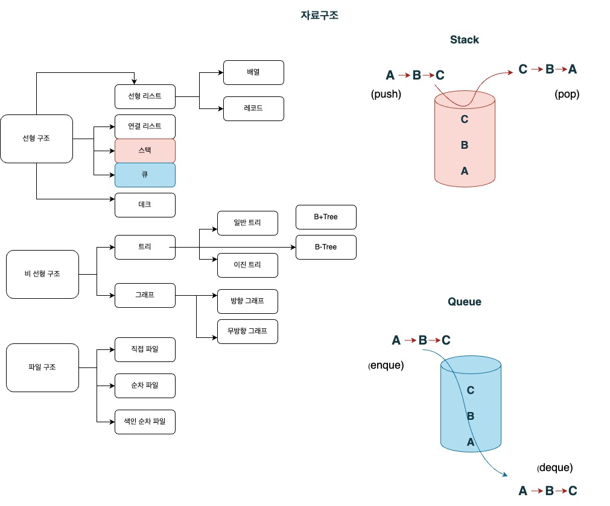
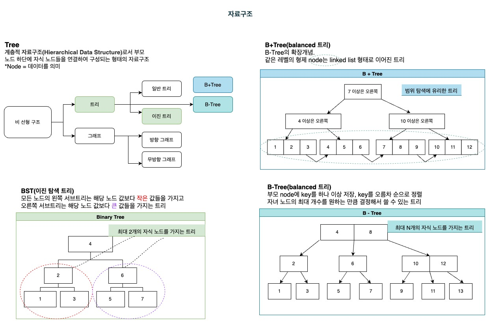

### 자료 구조 전반

### Stack & Queue

## 

### Tree

## 

1. Binary Tree - 자식 node를 **최대 2개** 가질 수 있는 Tree

2. B-Tree (Balanced Tree) - 자식 node를 2개 이상 가질 수 있는 Tree  
   (1)보다 더 많은 data를 저장할 수 있게 됨.

3. B+Tree - 같은 레벨의 형제 node는 연결 리스트 형태로 이어져 있는 Tree
   *index node
   *data node

### 팰린드롬(palindrome)
- 앞뒤를 뒤집어도 똑같은 문자열  
ex) 토마토, racecar  
https://school.programmers.co.kr/learn/courses/30/lessons/12904?