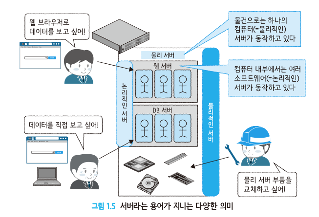
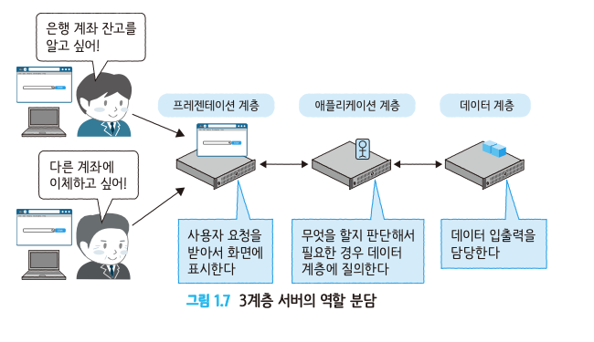

### 집약형 아키텍처

-   집약형 : 주요 업무를 모두 하나의 컴퓨터로 처리한다.
    구성이 간단하지만 이러한 대형 컴퓨터는 비싸고, 확장성에도 한계가 있다.

---

### 분할형 아키텍처

-   낮은 비용으로 시스템을 구축 가능하고, 서버(=컴퓨터) 대수를 늘릴 수 있어 확장성이 높다.

 

-   **수직 분할형 아키텍처**

    1. 클라이언트-서버형 아키텍처 (Client/Server)
       client - PC, 스마트폰, 태블릿 등등
       소수의 서버로 다수의 client를 처리할 수 있다는 장점이 있으나 client 측의 정기적인 s/w 업데이트가 필요하다. 

    2. 3계층형 아키텍처 (대부분의 이 구조를 채용)
        
        

-   **수평 분할형 아키텍처** - 용도가 같은 서버를 여러 대 늘려나가는 방식

    1. 단순 수평 분할형 아키텍처  
       Sharding / Partitioning

    2. 공유형 아키텍처  
       일부 계층에서 상호 접속이 이루어짐.

    -   엣지 컴퓨팅  
        지리적으로 가까운 위치에 있는 서버로 처리를 분산하고 처리 결과만 중앙으로 보내는 아키텍처

---

-   **지리 분할형 아키텍처**

    1. 스탠바이형 아키텍처   (Active-Standby) 구성.
       물리 서버를 최소 두 대 준비. 한 대 고장 시 가동 중인 s/w를 다른 서버로 옮겨서 운영하는 방식.
       Failover(s/w 자동 재시작)

    2. 재해 대책형 아키텍처  
       DR 구성
