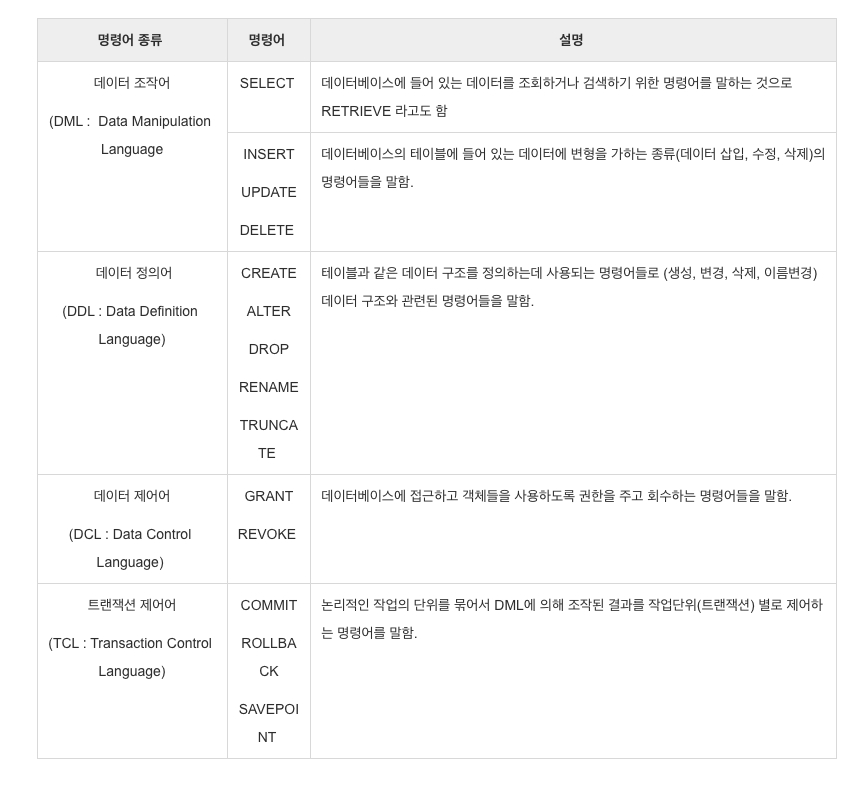

## 면접 질문

데이터베이스에 있어서 인덱스(Index)란 무엇인가요?
 

## 답변

- 인덱스는 데이터를 정렬한 자료구조로, 검색 속도를 향상시킨다는 장점을 가집니다.
- 테이블의 레코드를 풀 스캔하지 않고 Column을 색인화하는 것을 말하며, B-tree라는 자료구조를 통해 검색 속도를 향상시킵니다.

## 꼬리 질문 1

말씀하신 B-tree란 무엇인가요?

## 답변 1

- B-tree란 Balanced Tree를 의미합니다.
루트 노드, 리프 노드, 그리고 그 사이에 있는 브랜치 노드로 구성되어있는 자료구조입니다.
- 인덱스 검색할 시, 이 비트리 자료구조는 전체 테이블을 탐색하는 것이 아니라 찾고자 하는 데이터가 있을 법한 리프 노드를 찾아들어가 검색합니다
- 트리 탐색은 루트 노드부터 탐색이 일어나며 브랜치 노드를 거쳐 리프 노드로 내려오게 되는데, 찾고자 하는 데이터에 가까운 인덱스값을 추적하며 그 데이터가 가진 데이터 포인터를 찾아가며 검색이 들어가기 때문에 적은 탐색 횟수로도 빠르게 데이터를 찾을 수 있게 해줍니다

- B+tree 구조는 B-tree 구조의 한계를 보완. 
multi-level indexing & linked list

## 꼬리 질문 2

인덱싱의 단점이 있을까요?

## 답변 2

- Index 생성시, 비워져 있던 MYI 파일이 생성됩니다.
  - 이 때문에 .mdb 파일 크기가 증가하게 된다는 단점이 있습니다
- 한 페이지를 동시에 수정할 수 없게 되며 인덱스 된 Field에서 Data를 업데이트하거나, Record를 추가 또는 삭제시 성능이 떨어지게 됩니다.
  - 따라서 데이터 변경 작업이 자주 일어나는 칼럼에 인덱싱을 하는 경우, Index를 재작성해야 하므로, 성능에 영향을 미치게 됩니다
- 또한, 인덱스 자체가 비용이기도 합니다. 인덱스 리스트 그다음 컬렉션 순으로 탐색하도록 강제하기 때문에, 관련 읽기 비용이 들게 됩니다

## 꼬리 질문 3

그렇다면 어떤 컬럼에 인덱싱을 사용해야하고 어떤 때에 사용하지 않는 것이 좋을까요?

## 답변 3

- Good : where 절, foreign key 컬럼, 혹은 join / order by 절에서 사용 시
- Bad : 데이터의 중복도가 높은 칼럼이거나(ex. id) DML이 자주 일어나는 컬럼의 경우

## 보충

- DML이 일어나는 상황

  - INSERT

    - 기존 Block에 여유가 없을 때, 새로운 Data가 입력됨
      - 새로운 Block을 할당 받은 후, Key를 옮기는 작업을 수행 (**많은 양의 Redo가 기록**되고, 유발)
      - Index split 작업 동안, 해당 Block의 Key 값에 대해서 DML이 블로킹 됨... 대기 이벤트 발생

  - DELETE

    - [Table과 Index 상황 비교]
    - Table에서 data가 delete 되는 경우 : Data가 지워지고, 다른 Data가 그 공간을 사용 가능
    - Index에서 Data가 delete 되는 경우 : Data가 지워지지 않고, 사용 안 됨 표시만 해둠.
    - Table의 Data 수와 Index의 Data 수가 다를 수 있음.

  - UPDATE
    - Table에서 update가 발생하면 -> Index는 Update 할 수 없음.
    - Index에서는 Delete가 발생한 후, 새로운 작업의 Insert 작업 / 2배의 작업이 소요되어, 힘듬

- DDL,DML,DCL이란?
  

## 참고자료

https://gyoogle.dev/blog/computer-science/data-base/Index-.html
